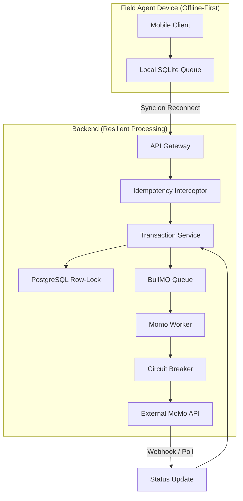

# AgoraSync: Offline-First Payment Engine for Emerging Markets


> A resilient, distributed payment processing system designed for unreliable networks. Built to handle offline transactions, eventual consistency, and external API failures without losing data or corrupting financial ledgers.

---

## 🎯 What is AgoraSync?

AgoraSync is a **production-grade payment engine** built for field agents in emerging markets where network connectivity is intermittent and unreliable. 

Imagine a field agent in rural Kenya collecting payments via mobile money (like M-Pesa). Network connectivity drops constantly. Standard payment apps would show an error and stop working. 

**AgoraSync doesn't stop.** It accepts transactions, enqueues them locally, handles eventual consistency via a specialized sync engine, and routes transactions securely through Mobile Money APIs once connectivity is restored—guaranteeing that no payment is lost or duplicated.

---

## 👥 Who is this designed for? (And Why It Matters)

AgoraSync is not built for a standard e-commerce checkout in a well-connected city. It is engineered for the harsh realities of emerging market infrastructure. Every architectural decision in this system is dictated by the physical and technological constraints of our three core personas:

### **Tier 1: The Field Agent (The Edge Node)**
* **The Persona:** Agricultural procurement officers, mobile money sub-agents, and FMCG distribution drivers operating in rural or peri-urban areas.
* **The Real-World Pain:** These agents act as walking point-of-sale terminals. If a payment app spins or throws a network error while they are collecting cash from a farmer, the agent loses the sale, and worse, loses the trust of the community. If the network drops *mid-transaction*, they are often accused of "stealing" the money. 
* **How AgoraSync Solves It (Technical Mapping):** 
  * **Offline-First & Optimistic UI:** The mobile client must never block the user. Transactions are saved to a local SQLite queue instantly. 
  * **Silent Retries:** The app uses a background sync engine to flush the queue when connectivity returns, completely abstracting the network instability from the user.
  * **Low Bandwidth Optimization:** Payloads are kept strictly minimal to function on intermittent 2G/EDGE networks.

### **Tier 2: The Back-Office Reconciler (The Source of Truth)**
* **The Persona:** Operations staff and finance clerks at the headquarters managing the ledger.
* **The Real-World Pain:** Mobile Money APIs (like M-Pesa or MTN MoMo) are notorious for dropping webhooks. A user's phone gets debited, but the merchant's system never receives the success callback. The reconciler is then forced to manually match CSV exports from the telecom provider against internal database logs to figure out who to credit. It is a nightmare of lost revenue and angry customers.
* **How AgoraSync Solves It (Technical Mapping):**
  * **Strict Idempotency:** By enforcing UUIDv7 keys, we guarantee that even if the telecom provider sends the same webhook 10 times, the ledger is only updated once.
  * **SAGA Compensation & DLQ:** If a transaction gets stuck in limbo (e.g., funds reserved but MoMo API times out), the system automatically compensates (releases funds) or routes the failure to a Dead Letter Queue. The reconciler gets a clean dashboard of *exactly* what failed and why, eliminating manual CSV matching.
  * **Audit Trails:** Every state change (PENDING -> RESERVED -> SUCCESS/FAILED) is immutably logged for regulatory compliance.

### **Tier 3: The Enterprise Integrator (The API Consumer)**
* **The Persona:** Fintech startups, logistics companies, or large agri-tech platforms that need to disburse micro-payments to thousands of users but don't want to build the payment infrastructure themselves.
* **The Real-World Pain:** Building a resilient, fault-tolerant payment gateway that handles telecom outages, rate limits, and eventual consistency takes a team of senior engineers months to build.
* **How AgoraSync Solves It (Technical Mapping):**
  * **Clean API Contract:** We expose a simple, well-documented REST API. The integrator just sends a payload with an idempotency key.
  * **Abstracted Complexity:** We hide the complexity of Circuit Breakers, Exponential

---

## 🏗️ System Architecture



---

## 🛡️ Core Engineering Pillars

### 1. **Idempotency Defense**
Prevents "Thundering Herd" duplicate charges using UUIDv7 keys and Redis distributed locks. If a client retries the same request 10 times, only one executes; the rest return cached results instantly.

### 2. **SAGA Pattern with Compensation**
Atomically reserves funds before calling external APIs using PostgreSQL row-level locking. If the MoMo API fails permanently, funds are **automatically released** back to the user's balance.

### 3. **Circuit Breaker & Exponential Backoff**
Protects the system from cascading failures when the external MoMo gateway is down. Retries use exponential backoff (2s, 4s, 8s, 16s, 32s) with jitter to prevent thundering herd.

### 4. **Eventual Consistency**
Designed for offline-first sync, resolving conflicts without data loss using vector clocks and state-based reconciliation.

---

## 🚀 Complete Setup & Run Guide

### 📋 Prerequisites
Ensure you have the following installed on your machine:
- **Node.js** (v18 or higher) & npm
- **Docker Desktop** (running in the background)
- **Git**

### ⚙️ Step 1: Clone and Install Dependencies
```bash
# Clone the repository
git clone https://github.com/paul-muzyamba/agorasync.git
cd agorasync

# Install all workspace dependencies
npm install
```

###  Step 2: Start Local Infrastructure
This spins up PostgreSQL (on port 5433 to avoid Windows conflicts) and Redis in Docker containers.
```bash
docker-compose -f infra/docker-compose.yml up -d
```
*(Wait ~5 seconds for the database to fully initialize).*

### 🗄️ Step 3: Setup the Database
Generate the Prisma client and apply the database migrations.
```bash
# Navigate to the database package
cd packages/database

# Generate the Prisma TypeScript client
npm run generate

# Apply the schema to the local PostgreSQL database
npm run migrate
# (If prompted for a migration name, type "init" and press Enter)

cd ../..
```

###  Step 4: Run the Application
Start the NestJS backend development server.
```bash
cd apps/api
npm run dev
```
*You should see: `🚀 AgoraSync API running on http://localhost:3000`*

---

## 🧪 Step 5: Verify It Works (Quick Test)

Open a new terminal and run these commands to simulate a real payment flow:

**1. Seed a test account with $1000:**
```bash
curl -X POST http://localhost:3000/seed/account \
  -H "Content-Type: application/json" \
  -d '{"accountId": "agent-001", "merchantId": "merch-1", "balance": 1000}'
```

**2. Process a $150 payment:**
```bash
curl -X POST http://localhost:3000/transactions \
  -H "Content-Type: application/json" \
  -H "x-idempotency-key: test-payment-001" \
  -d '{"accountId": "agent-001", "amount": 150}'
```
*(Expected response: `{"status":"ACCEPTED","transactionId":"...","message":"Processing asynchronously"}`)*

**3. View the Database:**
Open [Prisma Studio](http://localhost:5555) to visually verify the account balance dropped to 850 and the transaction was recorded.
```bash
cd packages/database
npm run studio
```

---

## 📡 API Reference

### **Create Transaction**
Process a payment transaction.

**Endpoint**: `POST /transactions`

**Headers**:
| Header | Required | Description |
|--------|----------|-------------|
| `x-idempotency-key` | ✅ | UUID to prevent duplicate processing |
| `Content-Type` | ✅ | `application/json` |

**Request Body**:
```json
{
  "accountId": "agent-001",
  "amount": 150.00
}
```

**Response** (201 Created):
```json
{
  "status": "ACCEPTED",
  "transactionId": "0764202f-ef28-4e1c-9270-75b9f0d20149",
  "message": "Processing asynchronously"
}
```

**Status Values**:
- `ACCEPTED`: Transaction queued for processing
- `ALREADY_PROCESSED`: Duplicate request detected (idempotency)

---

### **Seed Account (Test Only)**
Create a test account with initial balance.

**Endpoint**: `POST /seed/account`

**Request Body**:
```json
{
  "accountId": "agent-001",
  "merchantId": "merch-1",
  "balance": 1000
}
```

---

### **Chaos Testing Endpoints**

**Trigger MoMo API Failure**:
```bash
curl -X POST http://localhost:3000/chaos/fail-momo
```

**Restore MoMo API**:
```bash
curl -X POST http://localhost:3000/chaos/restore-momo
```

**Check Chaos Status**:
```bash
curl http://localhost:3000/chaos/status
```

---

##  Chaos Testing (How to Break This System)

We engineered for failure. Test the resilience:

### **1. Test Idempotency (Duplicate Prevention)**
```bash
# Send the same request 5 times with the same idempotency key
curl -X POST http://localhost:3000/transactions \
  -H "Content-Type: application/json" \
  -H "x-idempotency-key: test-123" \
  -d '{"accountId": "agent-001", "amount": 100}'

# Run it 5 times. Only 1 hits the DB. 4 return cached results instantly.
```

### **2. Test Circuit Breaker & SAGA Compensation**
```bash
# 1. Force the MoMo API to fail 100% of the time
curl -X POST http://localhost:3000/chaos/fail-momo

# 2. Send a transaction
curl -X POST http://localhost:3000/transactions \
  -H "Content-Type: application/json" \
  -H "x-idempotency-key: chaos-test-1" \
  -d '{"accountId": "agent-001", "amount": 50}'

# 3. Watch server logs: Worker retries → Circuit breaker trips → Compensation releases funds

# 4. Check Prisma Studio: Balance remains unchanged, reservedBalance is 0. 
# The system failed safely without losing user funds.
```

---

## 📁 Project Structure

```text
agorasync/
├── apps/
│   ├── api/                     # NestJS Backend
│   │   ├── src/
│   │   │   ├── common/          # Interceptors, Guards, Filters
│   │   │   ├── modules/         # Domain modules (transactions, seed, chaos)
│   │   │   ├── prisma/          # Database client
│   │   │   └── workers/         # BullMQ background workers
│   │   └── package.json
│   └── mobile/                  # React Native (Future)
├── packages/
│   └── database/                # Shared Prisma schema & client
│       ├── prisma/
│       │   └── schema.prisma    # Database schema
│       └── src/
│           └── index.ts         # Prisma client export
├── infra/
│   └── docker-compose.yml       # PostgreSQL + Redis
├── docs/
│   └── DECISIONS/
│       └── 001-saga-pattern.md  # Architecture Decision Records
├── scripts/                     # Utility scripts
├── README.md
└── package.json                 # Workspace root
```

---

## 🛠️ Tech Stack

| Layer | Technology | Why |
|-------|------------|-----|
| **Backend Framework** | NestJS (TypeScript) | Enterprise-grade, excellent async I/O handling |
| **Database** | PostgreSQL | ACID compliance for financial transactions |
| **ORM** | Prisma | Type-safe queries, excellent DX |
| **Message Queue** | Redis + BullMQ | Reliable job queuing with retries |
| **Caching** | Redis | Idempotency cache, distributed locks |
| **Testing** | Jest + Supertest | Unit & integration testing |
| **Infrastructure** | Docker | Containerized PostgreSQL & Redis |

---

## 🧠 Architecture Decisions

### **Decision 1: SAGA Pattern for Financial Transactions**

**Context**: Calling an external Mobile Money (MoMo) API is not an atomic database operation. If the DB updates but the MoMo API fails, the system enters an inconsistent state, potentially locking user funds permanently.

**Decision**: We use a local SAGA pattern with automatic compensation:
1. **Step 1 (Reserve)**: Atomically deduct from `balance` and add to `reservedBalance` using PostgreSQL row-level locking.
2. **Step 2 (Execute)**: Push job to BullMQ background worker.
3. **Step 3 (Compensate)**: If the worker exhausts retries (or the Circuit Breaker opens), automatically decrement `reservedBalance` back to `balance` and mark the transaction `FAILED`.

**Consequences**:
- ✅ **Positive**: Funds are never "lost" or permanently locked. The system is self-healing.
- ⚠️ **Negative**: Requires careful monitoring of the Dead Letter Queue (DLQ) for edge cases.

---

### **Decision 2: Idempotency via Redis Distributed Locks**

**Context**: In unreliable networks, clients aggressively retry failed HTTP requests. Without idempotency, a user tapping "Pay" twice could be charged twice.

**Decision**: We enforce idempotency at the API Interceptor level using:
1. Client-generated `x-idempotency-key` (UUIDv7).
2. Redis `SETNX` (Set if Not Exists) to acquire a 10-second distributed lock.
3. If locked, return `409 Conflict`. If processed, cache the response in Redis for 24 hours.

**Consequences**:
- ✅ **Positive**: Zero database hits for duplicate requests. Sub-millisecond response for retries.
- ⚠️ **Negative**: Adds Redis as a hard dependency for the API layer.

---

## 📝 Development Commands Quick Reference

```bash
# Start Infrastructure
docker-compose -f infra/docker-compose.yml up -d

# Stop Infrastructure
docker-compose -f infra/docker-compose.yml down

# Generate Prisma Client
cd packages/database && npm run generate

# Run Database Migrations
cd packages/database && npm run migrate

# Open Prisma Studio
cd packages/database && npm run studio

# Run Backend Server
cd apps/api && npm run dev
```

---

## 🐛 Troubleshooting

### **Prisma Generate Fails (EPERM Error)**
If you see "EPERM: operation not permitted" on Windows:
```bash
# Stop all Node processes
taskkill /F /IM node.exe

# Delete the locked folder
rm -rf node_modules/.prisma

# Regenerate
cd packages/database && npm run generate
```

---

## 📄 License

MIT License

Copyright (c) 2026 Paul Muzyamba

Permission is hereby granted, free of charge, to any person obtaining a copy
of this software and associated documentation files (the "Software"), to deal
in the Software without restriction, including without limitation the rights
to use, copy, modify, merge, publish, distribute, sublicense, and/or sell
copies of the Software, and to permit persons to whom the Software is
furnished to do so, subject to the following conditions:

The above copyright notice and this permission notice shall be included in all
copies or substantial portions of the Software.

---

## 👤 Author

**Paul Muzyamba**
- GitHub: [@paul-muzyamba](https://github.com/paul-muzyamba)
- Project: AgoraSync - Offline-First Payment Engine

---

*Built with ❤️ for resilient systems in unreliable environments.*